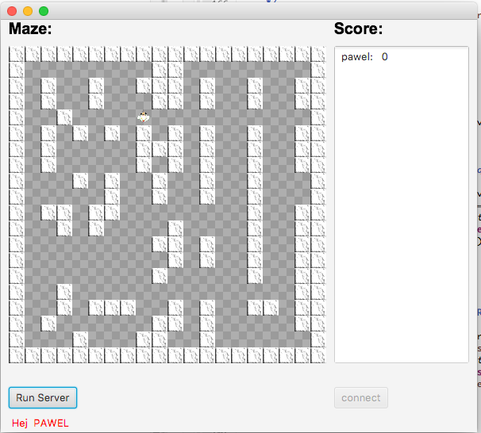

# The Network Game Java

Small network game, where several players move a figure on board, bump into each other and shoot each other. You get positive and negative points.

You get 1 point for moving, ­1 for hitting a wall, 10 for bumping into another player, who the gets ­10

```
* concurrency problem 
* synchronize the access of multiple threads to the shared resource.
```
<p align="center">
  
</p>


